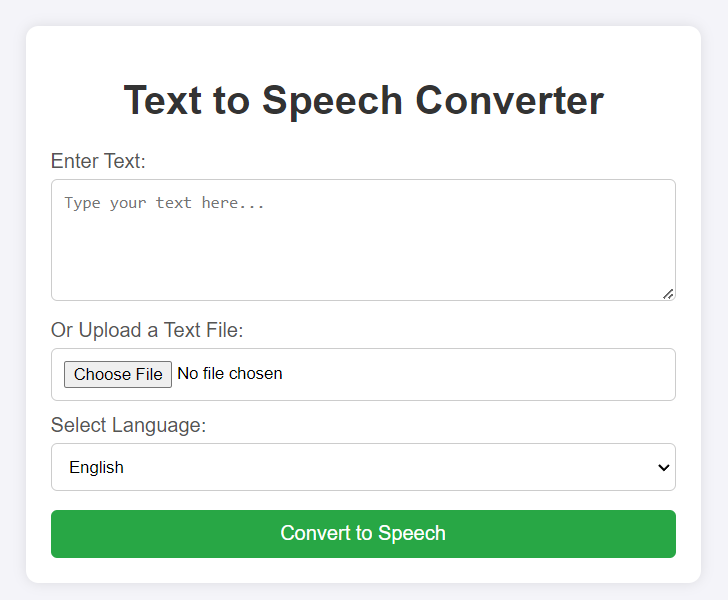
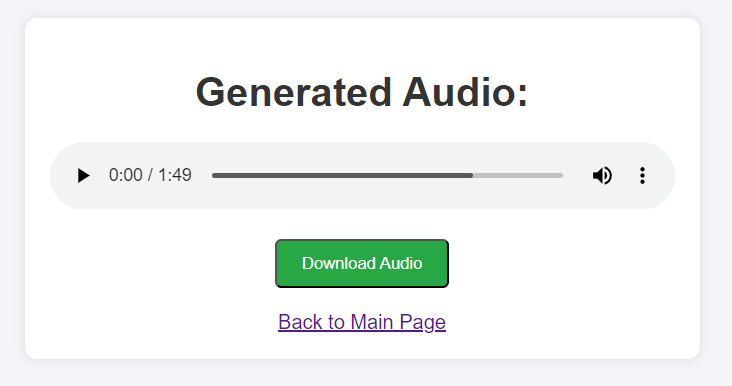

# Task1-CodeTech
NAME: Dhara Savani  
DOMAIN NAME: Machine Learning  
INTERN ID: CT08DS1649  
BATCH DURATION: JUNE to JULY 2024  
MENTOR: SRAVANI GOUNI

## Overview of the Project

### Project: TEXT-TO-AUDIO GENERATION APPLICATION

Text to Speech Converter is a web application built with Flask that converts text input into speech using the Google Text-to-Speech (gTTS) API. It provides a user-friendly interface for entering text, selecting languages, and generating downloadable audio files in MP3 format.

## Screenshots of Generated Pages

### Index Page



### Result Page



### Features

- **Text Input**: Enter text directly or upload text files for conversion.
- **Language Selection**: Supports multiple languages including English, Spanish, French, and German.
- **Audio Output**: Listen to generated audio directly on the webpage.
- **Download Option**: Download the generated audio file for offline use.
- **Responsive Design**: Clean and intuitive user interface designed with HTML/CSS and Bootstrap.

## Technologies Used

- **Flask**: Micro web framework for backend development.
- **gTTS (Google Text-to-Speech)**: API for converting text into speech audio files.
- **MySQL**: Database for storing user preferences or logs (optional, if integrated).
- **Flask-MySQLdb**: Flask extension for MySQL integration.
- **mysql-connector-python**: Python driver for MySQL.
- **HTML/CSS**: Frontend design and layout.
- **Bootstrap**: Frontend framework for responsive and mobile-friendly design.

## Setup Instructions

1. **Clone the repository:**
   ```bash
   git clone https://github.com/ds954/Task1-CodeTech.git
   cd Task1-CodeTech
   
2. **Install Dependencies:**

    ```sh
    pip install -r requirements.txt
    ```

3. **Run the Application:**

    ```sh
    python app.py
    ```
